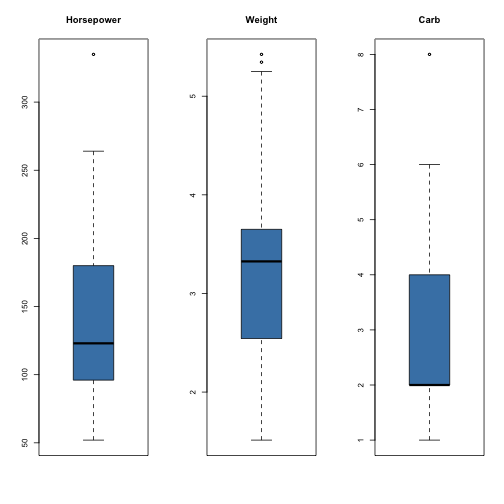
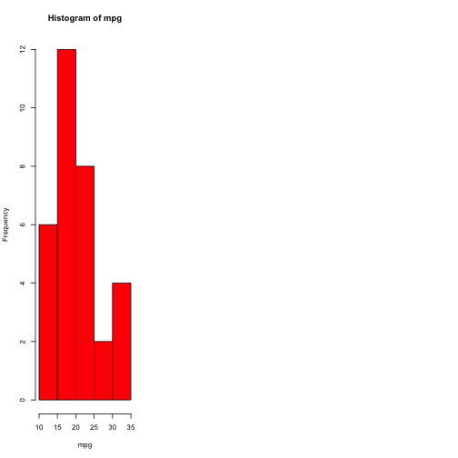

MyShineyApp
========================================================
author: Pete Petersen
date: 09-20-2020
autosize: true

First Slide
========================================================

I built an application for the JHU Data Science Specialization for the Data Products course.  Come check out this really cool app that was done in slidify:    
 <https://petepetersen423.shinyapps.io/ShinyApp/>.

- It was built by hand
- It has two controls
- And uses best of all uses MTCARS dataset

About the MTCARS dataset used in the shiny app.
========================================================


```r
summary(mtcars$hp)
```

```
   Min. 1st Qu.  Median    Mean 3rd Qu.    Max. 
   52.0    96.5   123.0   146.7   180.0   335.0 
```

```r
summary(mtcars$wt)
```

```
   Min. 1st Qu.  Median    Mean 3rd Qu.    Max. 
  1.513   2.581   3.325   3.217   3.610   5.424 
```

```r
summary(mtcars$carb)
```

```
   Min. 1st Qu.  Median    Mean 3rd Qu.    Max. 
  1.000   2.000   2.000   2.812   4.000   8.000 
```

Exploring the MTCARS Data
========================================================



Thank you for using my App
========================================================

- Easy to use, just select the bins  
- Fun to explore pick you preferred color  

If you think this a a great way to spend a few hours then take the course!!

Regards,
  Pete
